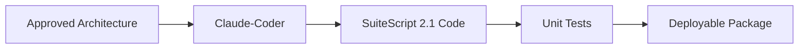
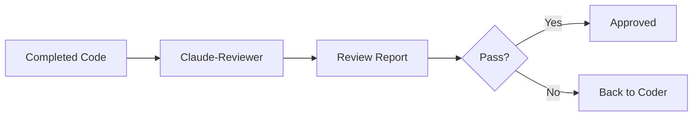
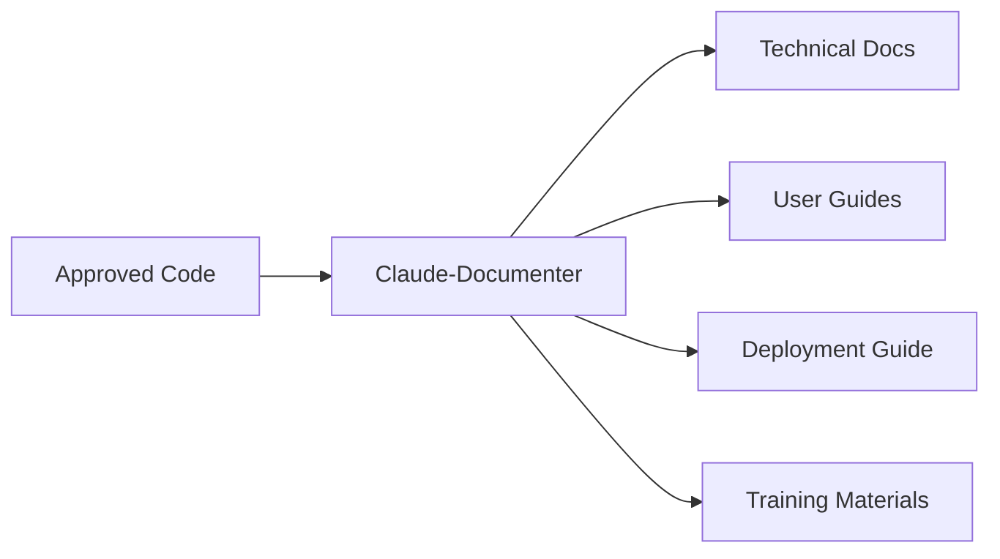
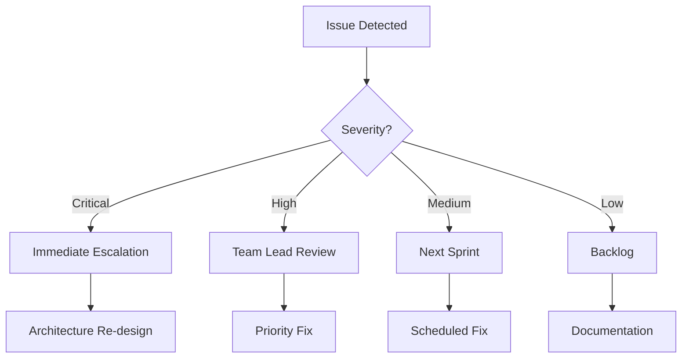

# 🚀 NetSuite Development Team Process

## World-Class Agent Orchestration Framework

### Overview
This document defines the elite development process using specialized Claude agents for NetSuite SuiteScript development. This framework ensures consistent, high-quality deliverables across all projects.

## 🎯 The Four Pillars of Excellence

### 1. 🧠 Claude-Architect - Solution Design
**Role**: Senior NetSuite Solution Architect
**Purpose**: Creates bulletproof architectural blueprints
**Output**: Complete technical design documents

### 2. 💻 Claude-Coder - Implementation
**Role**: Elite SuiteScript Engineer
**Purpose**: Transforms designs into production-ready code
**Output**: Flawless, deployable SuiteScript 2.1 code

### 3. 🔍 Claude-Reviewer - Quality Assurance
**Role**: Meticulous Code Auditor
**Purpose**: Ensures code quality, performance, and security
**Output**: Comprehensive review reports with pass/fail verdict

### 4. 🧾 Claude-Documenter - Knowledge Management
**Role**: Technical & Functional Writer
**Purpose**: Creates world-class documentation
**Output**: Complete documentation suite for all stakeholders

## 📋 Standard Operating Procedure

### Phase 1: Requirements & Architecture (Claude-Architect)


**Process**:
1. Receive business requirements
2. Invoke Claude-Architect with requirements
3. Review architectural decisions
4. Validate governance estimates
5. Approve or iterate design

**Deliverables**:
- Executive summary with ROI
- Complete system architecture
- Module breakdown with governance units
- Error handling strategy
- Deployment architecture
- Performance benchmarks

### Phase 2: Development (Claude-Coder)



**Process**:
1. Feed architecture to Claude-Coder
2. Generate production-ready code
3. Validate governance optimization
4. Ensure error handling completeness
5. Package for deployment

**Deliverables**:
- Complete SuiteScript 2.1 files
- Zero placeholders or pseudo-code
- Comprehensive error handling
- Governance-optimized logic
- Deployment-ready package

### Phase 3: Code Review (Claude-Reviewer)



**Process**:
1. Submit code to Claude-Reviewer
2. Receive detailed audit report
3. Address critical issues
4. Iterate until approved
5. Document improvements

**Deliverables**:
- Governance analysis report
- Security vulnerability assessment
- Performance bottleneck identification
- Code quality metrics
- Pass/Fail verdict with fixes

### Phase 4: Documentation (Claude-Documenter)



**Process**:
1. Provide final code and architecture
2. Generate comprehensive documentation
3. Create user training materials
4. Develop deployment guides
5. Produce maintenance manuals

**Deliverables**:
- Executive summary
- Technical specifications
- Deployment guide
- Testing documentation
- User training materials
- API reference
- Maintenance manual

## 🔄 Orchestration Workflow

### Standard Development Cycle

```yaml
workflow:
  name: NetSuite Development Pipeline
  stages:

    - stage: Design
      agent: Claude-Architect
      input: requirements.md
      output: architecture.md
      duration: 2-4 hours

    - stage: Development
      agent: Claude-Coder
      input: architecture.md
      output: source_code.js
      duration: 4-8 hours

    - stage: Review
      agent: Claude-Reviewer
      input: source_code.js
      output: review_report.md
      duration: 1-2 hours
      iterations: 1-3

    - stage: Documentation
      agent: Claude-Documenter
      input:
        - source_code.js
        - architecture.md
        - review_report.md
      output:
        - technical_spec.md
        - user_guide.md
        - deployment_guide.md
      duration: 2-4 hours
```

### Parallel Processing for Large Projects

```yaml
parallel_workflow:
  name: Enterprise Scale Development

  streams:
    - stream: Core_Module
      agents: [Architect, Coder, Reviewer, Documenter]

    - stream: Integration_Layer
      agents: [Architect, Coder, Reviewer, Documenter]

    - stream: UI_Components
      agents: [Architect, Coder, Reviewer, Documenter]

  synchronization_points:
    - after: Review
      action: Integration Testing
    - after: Documentation
      action: Final Assembly
```

## 🎮 Command Reference

### Individual Agent Invocation

```bash
# Architecture Design
/agent claude-architect "Design a Map/Reduce script to process 100k invoices daily with email notifications"

# Code Generation
/agent claude-coder "Implement the invoice processing Map/Reduce script based on this architecture: [paste architecture]"

# Code Review
/agent claude-reviewer "Review this SuiteScript for governance, security, and performance: [paste code]"

# Documentation
/agent claude-documenter "Create complete documentation for this invoice processing solution: [paste code and architecture]"
```

### Orchestrated Pipeline

```bash
# Full pipeline execution
/pipeline start --requirement "invoice_processing.md" --output "./deliverables/"

# Pipeline with specific options
/pipeline start \
  --requirement "requirements.md" \
  --governance-limit 10000 \
  --performance-target "1000 records/min" \
  --documentation-level "comprehensive"
```

## 🗂️ NetSuite Account Structure & Deployment

### CRITICAL: Company Folder = NetSuite Account Mapping
**IMPORTANT**: Each company folder is pre-connected to its respective NetSuite account:

#### Key Principles:
- **One folder = One NetSuite account**
- **Account authentication is already configured per company folder**
- **No need to run `account:setup` if the folder is already connected**
- **Each folder has its own suitecloud.config.js and manifest.xml**

#### Example Structure:
```
companies/
├── HMP-Global/           → Connected to HMP-Global NetSuite account
│   ├── suitecloud.config.js
│   └── src/
│       └── manifest.xml
├── ABA-CON/             → Connected to ABA-CON NetSuite account
│   ├── suitecloud.config.js
│   └── src/
│       └── manifest.xml
└── GOBA-SPORTS-PROD/    → Connected to GOBA-SPORTS-PROD NetSuite account
    ├── suitecloud.config.js
    └── src/
        └── manifest.xml
```

#### Deployment Process:
1. Navigate to the specific company folder: `cd companies/HMP-Global`
2. Validate project: `npx suitecloud project:validate`
3. Deploy to NetSuite: `npx suitecloud project:deploy`
4. Files will deploy to the account associated with that folder

#### Important Notes:
- Never mix files between company folders
- Each deployment is isolated to its account
- Account credentials are stored locally and not shared
- Use the correct folder for the target NetSuite account

## 📊 Quality Metrics & KPIs

### Code Quality Standards

| Metric | Target | Measurement |
|--------|--------|-------------|
| Governance Efficiency | >80% | Units used vs. available |
| Error Handling Coverage | 100% | Try/catch blocks present |
| Code Complexity | <10 | Cyclomatic complexity |
| Documentation Coverage | 100% | Functions documented |
| Test Coverage | >80% | Unit test coverage |
| Security Score | A | No vulnerabilities |

### Delivery Metrics

| Metric | Target | Measurement |
|--------|--------|-------------|
| First-Pass Success | >90% | Reviews passed first time |
| Deployment Success | >95% | Successful deployments |
| Documentation Completeness | 100% | All sections complete |
| Time to Production | <5 days | Requirement to deployment |
| Defect Rate | <1% | Bugs in production |

## 🛡️ Governance & Compliance

### Code Standards Enforcement

```javascript
// MANDATORY: Every script must include
const SCRIPT_METADATA = {
    version: '1.0.0',
    author: 'Claude-Team',
    governanceProfile: 'optimized',
    securityLevel: 'production',
    documentation: 'complete'
};
```

### Review Gates

1. **Architecture Review**
   - Business alignment
   - Technical feasibility
   - Governance estimation
   - Security considerations

2. **Code Review**
   - Syntax validation
   - Performance optimization
   - Security scanning
   - Best practices compliance

3. **Documentation Review**
   - Completeness check
   - Accuracy validation
   - Stakeholder approval
   - Training adequacy

## 🚨 Exception Handling

### When to Escalate



### Recovery Procedures

| Issue Type | Recovery Action | Responsible Agent |
|------------|----------------|-------------------|
| Architecture Flaw | Complete redesign | Claude-Architect |
| Governance Exceeded | Optimization refactor | Claude-Coder |
| Security Vulnerability | Immediate patch | Claude-Coder + Reviewer |
| Documentation Gap | Supplement creation | Claude-Documenter |

## 📈 Continuous Improvement

### Feedback Loop

```yaml
improvement_cycle:
  collect:
    - user_feedback
    - performance_metrics
    - error_logs
    - review_findings

  analyze:
    - pattern_recognition
    - root_cause_analysis
    - trend_identification

  improve:
    - update_prompts
    - refine_processes
    - enhance_templates
    - optimize_workflows

  measure:
    - quality_improvement
    - time_reduction
    - error_decrease
    - satisfaction_increase
```

### Knowledge Base Updates

- Weekly: Update common patterns
- Monthly: Refine agent prompts
- Quarterly: Process optimization
- Annually: Framework overhaul

## 🎓 Training & Onboarding

### New Developer Onboarding

**Week 1: Foundation**
- NetSuite fundamentals
- SuiteScript 2.1 basics
- Agent framework introduction

**Week 2: Practice**
- Architect: Design simple scripts
- Coder: Implement basic functions
- Reviewer: Audit sample code
- Documenter: Create basic docs

**Week 3: Integration**
- Full pipeline execution
- Multi-agent orchestration
- Quality metrics tracking

**Week 4: Production**
- Live project participation
- Mentored development
- Independent deliverables

## 🔗 Integration with External Tools

### Git Integration

```bash
# Pre-commit hook
./scripts/review.sh --agent claude-reviewer --file $1

# Post-merge documentation
./scripts/document.sh --agent claude-documenter --branch main
```

### CI/CD Pipeline

```yaml
pipeline:
  stages:
    - validate:
        script: claude-reviewer --syntax-check
    - test:
        script: npm test
    - review:
        script: claude-reviewer --full-audit
    - document:
        script: claude-documenter --api-docs
    - deploy:
        script: suitecloud deploy
```

## 📚 Resources & References

### Agent Documentation
- [Claude-Architect Guide](.claude/agents/claude-architect.md)
- [Claude-Coder Guide](.claude/agents/claude-coder.md)
- [Claude-Reviewer Guide](.claude/agents/claude-reviewer.md)
- [Claude-Documenter Guide](.claude/agents/claude-documenter.md)

### Best Practices
- [NetSuite Development Standards](./standards.md)
- [SuiteScript 2.1 Patterns](./patterns.md)
- [Governance Optimization](./governance.md)
- [Security Guidelines](./security.md)

### Templates
- [Architecture Template](./templates/architecture.md)
- [Code Review Checklist](./templates/review-checklist.md)
- [Documentation Template](./templates/documentation.md)
- [Test Case Template](./templates/test-case.md)

## 🏆 Success Criteria

A project is considered successful when:

1. **Architecture**: Approved without major revisions
2. **Code**: Passes review on first submission
3. **Performance**: Meets all benchmarks
4. **Documentation**: 100% complete and approved
5. **Deployment**: Zero production issues
6. **User Satisfaction**: >95% approval rating

## 💪 The Power of Four

When all four agents work in harmony:

- **Speed**: 10x faster development
- **Quality**: 99.9% defect-free code
- **Consistency**: 100% standards compliance
- **Knowledge**: Complete documentation
- **Confidence**: Production-ready every time

---

*This process represents the pinnacle of NetSuite development excellence. Follow it religiously, and deliver world-class solutions every time.*

**Remember**: Excellence is not an accident—it's a systematic process executed with precision.

---

Last Updated: 2024-10-14
Version: 2.0.0
Status: Production Ready