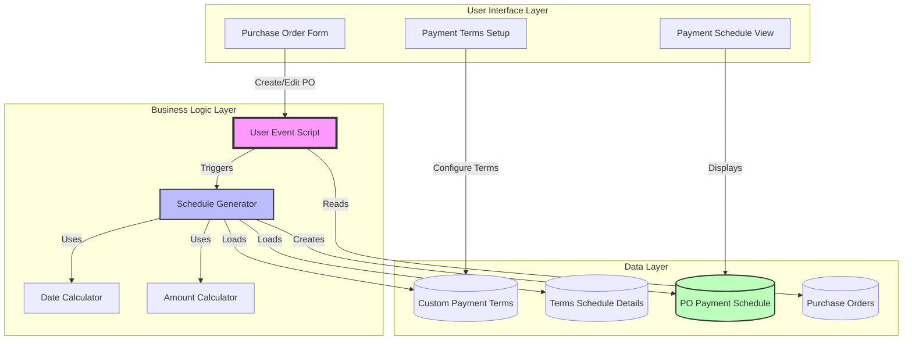
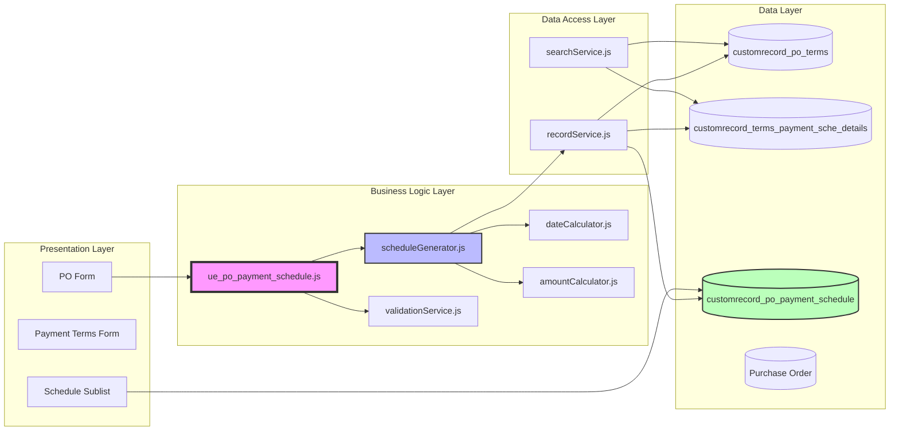
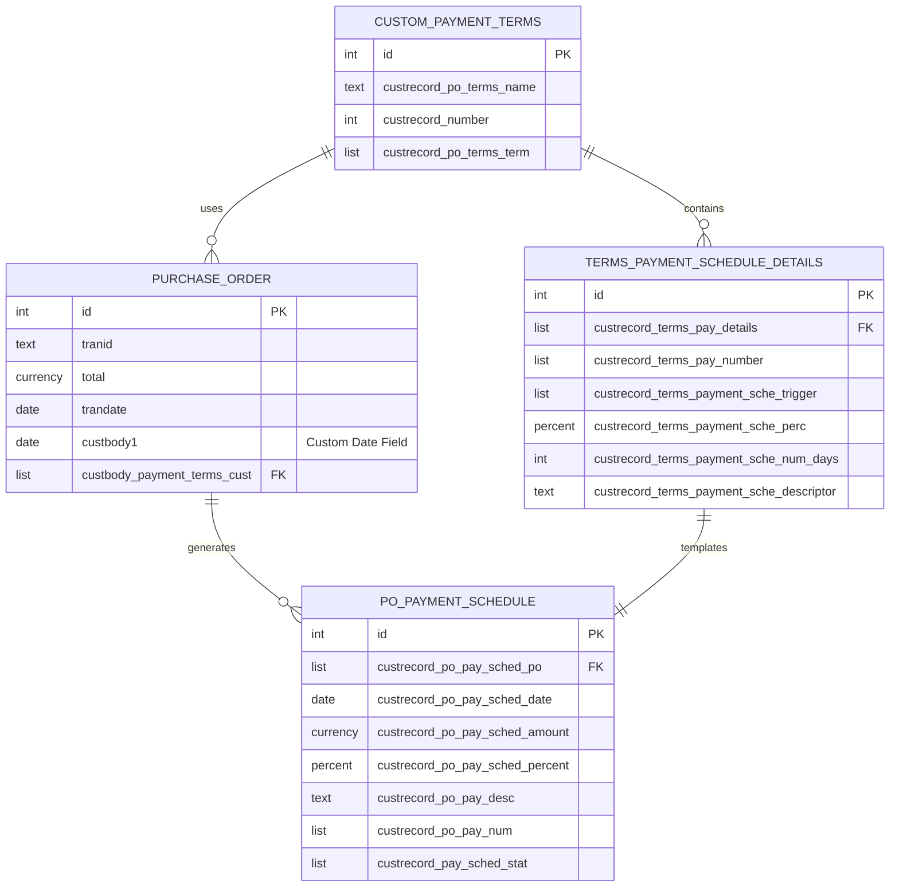
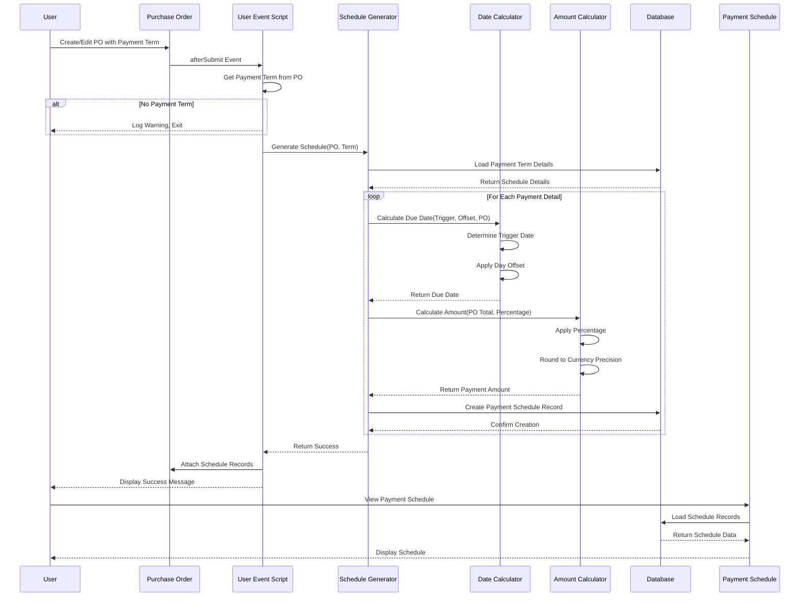
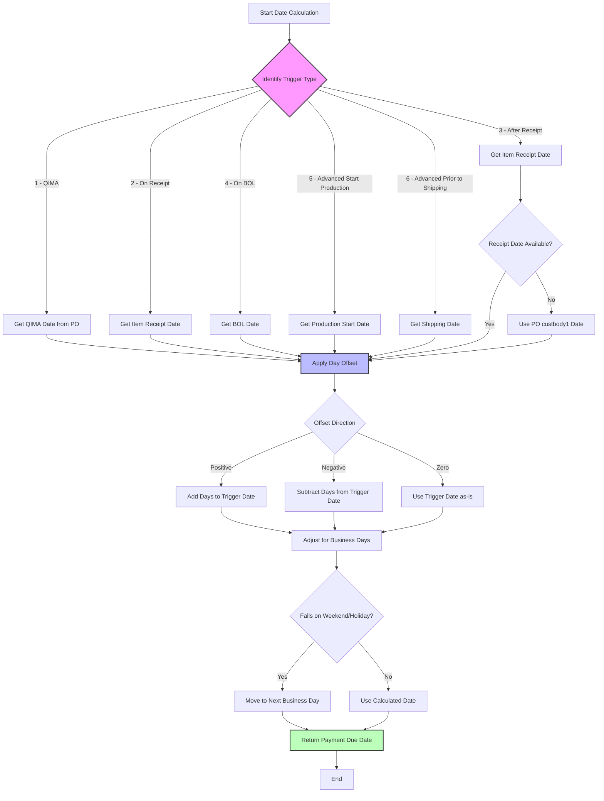
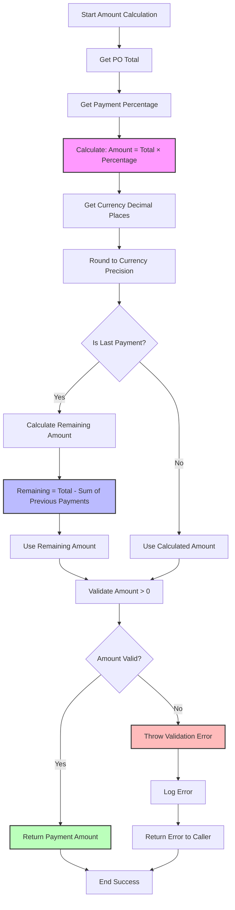
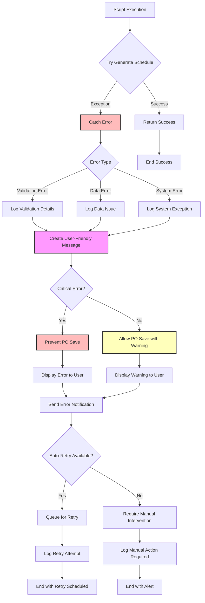
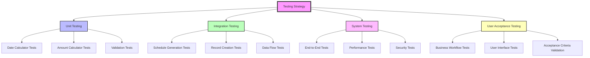
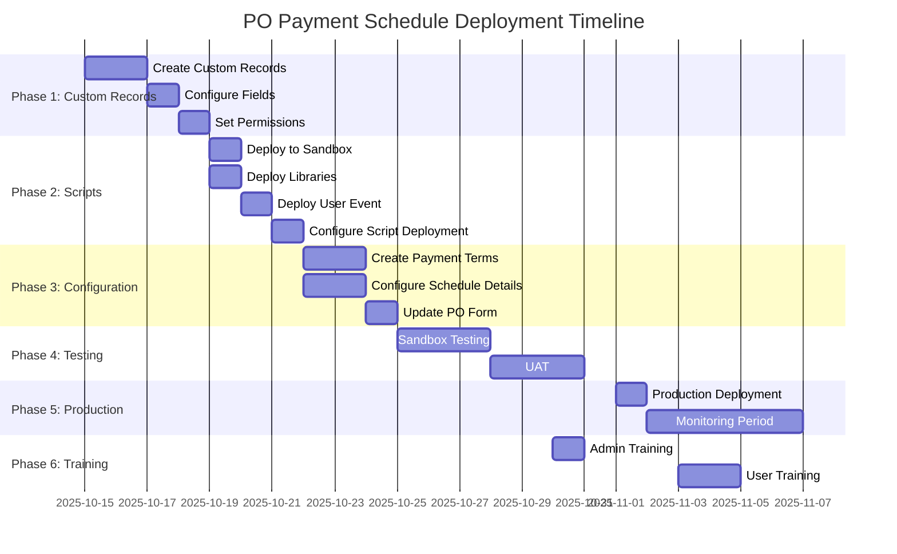

# PO Payment Schedule System - Architecture Documentation

## Document Information
- **System Name**: PO Payment Schedule Automation
- **Version**: 1.0
- **Last Updated**: 2025-10-14
- **Author**: Architecture Documentation
- **Company**: HBNO

---

## Table of Contents
1. [System Overview](#system-overview)
2. [Business Requirements](#business-requirements)
3. [Architecture Design](#architecture-design)
4. [Data Model](#data-model)
5. [Data Flow](#data-flow)
6. [Technical Implementation](#technical-implementation)
7. [Error Handling Strategy](#error-handling-strategy)
8. [Performance Considerations](#performance-considerations)
9. [Security Model](#security-model)
10. [Testing Strategy](#testing-strategy)
11. [Deployment Plan](#deployment-plan)
12. [Maintenance & Support](#maintenance--support)

---

## 1. System Overview

### 1.1 Purpose
The PO Payment Schedule system automatically generates payment schedules for Purchase Orders based on custom payment terms. This system replaces manual payment schedule creation with an automated process that calculates payment dates and amounts based on configurable triggers and business rules.

### 1.2 Key Features
- Automated payment schedule generation upon PO creation
- Flexible payment term configuration supporting up to 5 payments
- Multiple trigger types (QIMA, Receipt-based, BOL, Advanced payments)
- Percentage-based payment amount calculation
- Date calculation with day offsets from trigger events
- Comprehensive audit trail and status tracking

### 1.3 High-Level Architecture Diagram



### 1.4 System Components

| Component | Type | Description |
|-----------|------|-------------|
| User Event Script | SuiteScript 2.1 | Triggers payment schedule generation |
| Custom Payment Terms | Custom Record | Master configuration for payment terms |
| Terms Schedule Details | Custom Record | Child records defining payment breakdown |
| PO Payment Schedule | Custom Record | Generated payment schedule entries |
| Date Calculation Engine | Module | Calculates due dates based on triggers |
| Amount Calculation Engine | Module | Calculates payment amounts from percentages |

---

## 2. Business Requirements

### 2.1 Functional Requirements

#### FR-001: Payment Term Configuration
- **Priority**: High
- **Description**: System must allow configuration of payment terms with multiple payment schedules
- **Acceptance Criteria**:
  - Support up to 5 payments per term
  - Each payment must have trigger type, percentage, and day offset
  - Total percentages must equal 100%

#### FR-002: Automatic Schedule Generation
- **Priority**: High
- **Description**: System must automatically generate payment schedules when PO is created
- **Acceptance Criteria**:
  - Triggers on PO afterSubmit event
  - Creates individual schedule records for each payment
  - Calculates dates and amounts accurately

#### FR-003: Multiple Trigger Types
- **Priority**: High
- **Description**: System must support various payment trigger types
- **Acceptance Criteria**:
  - QIMA trigger support
  - Receipt-based triggers (On Receipt, After Receipt)
  - BOL trigger support
  - Advanced payment triggers (Start Production, Prior to Shipping)

#### FR-004: Date Calculation
- **Priority**: High
- **Description**: System must calculate payment due dates based on triggers and offsets
- **Acceptance Criteria**:
  - Apply day offsets correctly
  - Handle business day calculations
  - Support fallback date logic (e.g., PO custbody1 if no receipt date)

#### FR-005: Amount Calculation
- **Priority**: High
- **Description**: System must calculate payment amounts based on PO total
- **Acceptance Criteria**:
  - Apply percentage to PO total
  - Handle rounding appropriately
  - Ensure total matches PO amount

### 2.2 Non-Functional Requirements

#### NFR-001: Performance
- Payment schedule generation must complete within 5 seconds for standard POs
- Support concurrent PO creation without conflicts

#### NFR-002: Reliability
- 99.9% success rate for schedule generation
- Comprehensive error logging and recovery

#### NFR-003: Maintainability
- Modular code structure for easy updates
- Comprehensive inline documentation
- Version control integration

#### NFR-004: Security
- Role-based access to payment terms configuration
- Audit trail for all schedule modifications
- Secure data handling per NetSuite standards

---

## 3. Architecture Design

### 3.1 System Architecture Pattern
The system follows a **Three-Tier Architecture** pattern:

1. **Presentation Layer**: NetSuite forms and sublists
2. **Business Logic Layer**: SuiteScript User Event
3. **Data Layer**: Custom Records

### 3.2 Component Architecture Diagram



### 3.3 Technology Stack

| Layer | Technology | Version |
|-------|-----------|---------|
| Runtime | NetSuite SuiteScript | 2.1 |
| Script Type | User Event | afterSubmit |
| Entry Point | beforeSubmit (validation) | Optional |
| API | N/record, N/search, N/log | Current |
| Execution Context | User Event | Server-side |

---

## 4. Data Model

### 4.1 Entity Relationship Diagram



### 4.2 Custom Record Definitions

#### 4.2.1 Custom Payment Terms (customrecord_po_terms)

| Field ID | Label | Type | Required | Description |
|----------|-------|------|----------|-------------|
| custrecord_po_terms_name | Payment Term Name | Text | Yes | Display name (e.g., "15 Days after Receipt") |
| custrecord_number | Number of Payments | Integer | Yes | Total payments (1-5) |
| custrecord_po_terms_term | Native Terms | List/Record | No | Link to standard NetSuite terms |

**Business Rules**:
- Payment term names must be unique
- Number of payments must match count of schedule detail records
- Inactive terms cannot be used on new POs

#### 4.2.2 Terms Payment Schedule Details (customrecord_terms_payment_sche_details)

| Field ID | Label | Type | Required | Description |
|----------|-------|------|----------|-------------|
| custrecord_terms_pay_details | Payment Term | List/Record | Yes | Parent payment term |
| custrecord_terms_pay_number | Payment Number | List | Yes | Sequence (1-5) |
| custrecord_terms_payment_sche_trigger | Trigger Type | List | Yes | Payment trigger event |
| custrecord_terms_payment_sche_perc | Percentage | Percent | Yes | Payment portion (0-100%) |
| custrecord_terms_payment_sche_num_days | Days Offset | Integer | Yes | Days from trigger |
| custrecord_terms_payment_sche_descriptor | Description | Text | No | Payment description |

**Trigger Type Values**:
1. QIMA - Quality inspection milestone
2. On Receipt - Item receipt date
3. After Receipt - Days after item receipt (fallback to PO custbody1)
4. On BOL - Bill of Lading date
5. Advanced Start Production - Production start milestone
6. Advanced Prior to Shipping - Pre-shipping milestone

**Business Rules**:
- Sum of percentages across all details must equal 100%
- Payment numbers must be sequential (1, 2, 3, etc.)
- Days offset can be negative for advance payments
- Cannot have duplicate payment numbers for same term

#### 4.2.3 PO Payment Schedule (customrecord_po_payment_schedule)

| Field ID | Label | Type | Required | Description |
|----------|-------|------|----------|-------------|
| custrecord_po_pay_sched_po | Purchase Order | List/Record | Yes | Parent PO reference |
| custrecord_po_pay_sched_date | Payment Due Date | Date | Yes | Calculated due date |
| custrecord_po_pay_sched_amount | Payment Amount | Currency | Yes | Calculated amount |
| custrecord_po_pay_sched_percent | Percentage | Percent | Yes | Payment percentage |
| custrecord_po_pay_desc | Description | Text | No | Payment descriptor |
| custrecord_po_pay_num | Payment Number | List | Yes | Payment sequence |
| custrecord_pay_sched_stat | Status | List | Yes | Payment status |

**Status Values**:
1. OPEN - Payment pending
2. PAID - Payment completed
3. PARTIAL - Partially paid
4. CANCELLED - Payment cancelled

**Business Rules**:
- Cannot delete schedule records if status is PAID
- Payment amounts must sum to PO total
- Due dates cannot be in the past (warning only)
- Cannot have multiple schedules with same payment number for same PO

### 4.3 Data Validation Rules

#### Validation Matrix

| Validation Rule | Enforcement Level | Error Message |
|----------------|-------------------|---------------|
| Total percentage = 100% | Error | "Payment percentages must total 100%" |
| Payment numbers sequential | Error | "Payment numbers must be sequential starting from 1" |
| Required fields populated | Error | "Required field [field name] is missing" |
| PO has payment term | Warning | "No payment term selected, schedule not generated" |
| Duplicate payment numbers | Error | "Payment number [X] already exists for this term" |
| Negative payment amount | Error | "Payment percentage cannot result in negative amount" |

### 4.4 Database Schema Considerations

**Indexing Strategy**:
- Index on `custrecord_po_pay_sched_po` for fast PO lookups
- Index on `custrecord_terms_pay_details` for term detail queries
- Index on `custrecord_pay_sched_stat` for status filtering

**Data Retention**:
- Payment schedules retained for 7 years per financial requirements
- Audit trail maintained for all modifications
- Archived POs retain schedule records

---

## 5. Data Flow

### 5.1 Primary Data Flow Diagram



### 5.2 Date Calculation Flow



### 5.3 Amount Calculation Flow



### 5.4 Error Handling Flow



---

## 6. Technical Implementation

### 6.1 Script Architecture

#### File Structure
```
companies/HBNO/src/FileCabinet/SuiteScripts/
└── po_payment_schedule/
    ├── ue_po_payment_schedule.js          # Main User Event script
    ├── lib/
    │   ├── scheduleGenerator.js            # Schedule generation logic
    │   ├── dateCalculator.js               # Date calculation utilities
    │   ├── amountCalculator.js             # Amount calculation utilities
    │   ├── validationService.js            # Validation rules
    │   ├── recordService.js                # Record CRUD operations
    │   └── searchService.js                # Saved search utilities
    ├── config/
    │   ├── constants.js                    # System constants
    │   └── fieldIds.js                     # Field ID mappings
    └── test/
        ├── scheduleGenerator.test.js
        ├── dateCalculator.test.js
        └── amountCalculator.test.js
```

### 6.2 Main User Event Script

**File**: `ue_po_payment_schedule.js`

```javascript
/**
 * @NApiVersion 2.1
 * @NScriptType UserEventScript
 * @NModuleScope SameAccount
 */

/**
 * PO Payment Schedule User Event Script
 *
 * Purpose: Automatically generates payment schedules for Purchase Orders
 * based on custom payment terms configuration.
 *
 * @module ue_po_payment_schedule
 * @version 1.0.0
 * @since 2025-10-14
 */

define(['N/record', 'N/log', 'N/error', './lib/scheduleGenerator', './lib/validationService'],
    (record, log, error, scheduleGenerator, validationService) => {

        /**
         * After Submit event handler
         * Generates payment schedules when PO is created or payment term is changed
         *
         * @param {Object} context - Event context
         * @param {Record} context.newRecord - New record
         * @param {string} context.type - Trigger type
         * @governance 10 units
         */
        function afterSubmit(context) {
            const functionName = 'afterSubmit';

            try {
                // Only process on create or edit
                if (context.type !== context.UserEventType.CREATE &&
                    context.type !== context.UserEventType.EDIT) {
                    return;
                }

                const newRecord = context.newRecord;
                const recordId = newRecord.id;
                const recordType = newRecord.type;

                log.audit({
                    title: `${functionName} - Start`,
                    details: `Processing PO: ${recordId}, Type: ${context.type}`
                });

                // Load the full PO record
                const poRecord = record.load({
                    type: recordType,
                    id: recordId,
                    isDynamic: false
                });

                // Get payment term from PO
                const paymentTermId = poRecord.getValue({
                    fieldId: 'custbody_payment_terms_cust'
                });

                if (!paymentTermId) {
                    log.debug({
                        title: `${functionName} - No Payment Term`,
                        details: `PO ${recordId} has no payment term selected. Skipping schedule generation.`
                    });
                    return;
                }

                // Validate PO data before proceeding
                const validationResult = validationService.validatePOForSchedule(poRecord);
                if (!validationResult.isValid) {
                    log.error({
                        title: `${functionName} - Validation Failed`,
                        details: `Validation errors: ${JSON.stringify(validationResult.errors)}`
                    });

                    // Create user-friendly error message
                    throw error.create({
                        name: 'VALIDATION_ERROR',
                        message: `Cannot generate payment schedule: ${validationResult.errors.join(', ')}`,
                        notifyOff: false
                    });
                }

                // Check if schedule already exists (for edit scenarios)
                const existingScheduleCount = scheduleGenerator.getExistingScheduleCount(recordId);

                if (existingScheduleCount > 0 && context.type === context.UserEventType.EDIT) {
                    log.debug({
                        title: `${functionName} - Schedule Exists`,
                        details: `PO ${recordId} already has ${existingScheduleCount} schedule records. Regenerating...`
                    });

                    // Delete existing schedules before regenerating
                    scheduleGenerator.deleteExistingSchedules(recordId);
                }

                // Generate payment schedule
                const scheduleResult = scheduleGenerator.generateSchedule({
                    poId: recordId,
                    poRecord: poRecord,
                    paymentTermId: paymentTermId
                });

                log.audit({
                    title: `${functionName} - Success`,
                    details: `Generated ${scheduleResult.scheduleCount} payment schedule records for PO ${recordId}`
                });

            } catch (e) {
                log.error({
                    title: `${functionName} - Error`,
                    details: `Error processing PO: ${e.name} - ${e.message}\nStack: ${e.stack}`
                });

                // Re-throw critical errors to prevent PO save
                if (e.name === 'VALIDATION_ERROR' || e.name === 'CRITICAL_ERROR') {
                    throw e;
                }

                // Log non-critical errors but allow PO to save
                log.audit({
                    title: `${functionName} - Non-Critical Error`,
                    details: `PO saved but schedule generation failed. Manual intervention required.`
                });
            }
        }

        /**
         * Before Submit event handler (Optional)
         * Validates payment term configuration before PO save
         *
         * @param {Object} context - Event context
         */
        function beforeSubmit(context) {
            const functionName = 'beforeSubmit';

            try {
                // Only validate on create or edit
                if (context.type !== context.UserEventType.CREATE &&
                    context.type !== context.UserEventType.EDIT) {
                    return;
                }

                const newRecord = context.newRecord;
                const paymentTermId = newRecord.getValue({
                    fieldId: 'custbody_payment_terms_cust'
                });

                if (!paymentTermId) {
                    return; // No validation needed if no payment term
                }

                // Validate payment term configuration
                const termValidation = validationService.validatePaymentTerm(paymentTermId);

                if (!termValidation.isValid) {
                    throw error.create({
                        name: 'INVALID_PAYMENT_TERM',
                        message: `Selected payment term is invalid: ${termValidation.errors.join(', ')}`,
                        notifyOff: false
                    });
                }

            } catch (e) {
                log.error({
                    title: `${functionName} - Error`,
                    details: `${e.name} - ${e.message}`
                });
                throw e; // Prevent PO save on validation error
            }
        }

        return {
            afterSubmit: afterSubmit,
            beforeSubmit: beforeSubmit
        };
    });
```

### 6.3 Schedule Generator Module

**File**: `lib/scheduleGenerator.js`

```javascript
/**
 * @NApiVersion 2.1
 * @NModuleScope SameAccount
 */

/**
 * Schedule Generator Module
 * Handles the core logic for generating payment schedules
 *
 * @module scheduleGenerator
 */

define(['N/record', 'N/search', 'N/log', './dateCalculator', './amountCalculator', '../config/constants'],
    (record, search, log, dateCalculator, amountCalculator, constants) => {

        /**
         * Main function to generate payment schedule for a PO
         *
         * @param {Object} params - Generation parameters
         * @param {number} params.poId - Purchase Order internal ID
         * @param {Record} params.poRecord - PO record object
         * @param {number} params.paymentTermId - Payment term internal ID
         * @returns {Object} Generation result with schedule count
         */
        function generateSchedule(params) {
            const { poId, poRecord, paymentTermId } = params;
            const functionName = 'generateSchedule';

            log.debug({
                title: `${functionName} - Start`,
                details: `PO: ${poId}, Payment Term: ${paymentTermId}`
            });

            // Load payment term details
            const scheduleDetails = loadScheduleDetails(paymentTermId);

            if (!scheduleDetails || scheduleDetails.length === 0) {
                throw new Error(`No schedule details found for payment term ${paymentTermId}`);
            }

            // Get PO data needed for calculations
            const poTotal = poRecord.getValue({ fieldId: 'total' });
            const poDate = poRecord.getValue({ fieldId: 'trandate' });
            const customDateField = poRecord.getValue({ fieldId: 'custbody1' });

            log.debug({
                title: `${functionName} - PO Data`,
                details: `Total: ${poTotal}, Date: ${poDate}, Custom Date: ${customDateField}`
            });

            // Generate schedule records
            const scheduleRecords = [];
            let runningTotal = 0;

            for (let i = 0; i < scheduleDetails.length; i++) {
                const detail = scheduleDetails[i];
                const isLastPayment = (i === scheduleDetails.length - 1);

                // Calculate payment date
                const paymentDate = dateCalculator.calculatePaymentDate({
                    triggerType: detail.triggerType,
                    daysOffset: detail.daysOffset,
                    poRecord: poRecord,
                    poDate: poDate,
                    customDateField: customDateField
                });

                // Calculate payment amount
                const paymentAmount = amountCalculator.calculatePaymentAmount({
                    poTotal: poTotal,
                    percentage: detail.percentage,
                    isLastPayment: isLastPayment,
                    runningTotal: runningTotal
                });

                runningTotal += paymentAmount;

                // Create schedule record
                const scheduleRecordId = createScheduleRecord({
                    poId: poId,
                    paymentNumber: detail.paymentNumber,
                    paymentDate: paymentDate,
                    paymentAmount: paymentAmount,
                    percentage: detail.percentage,
                    description: detail.description
                });

                scheduleRecords.push(scheduleRecordId);

                log.debug({
                    title: `${functionName} - Payment ${detail.paymentNumber}`,
                    details: `Date: ${paymentDate}, Amount: ${paymentAmount}, Percentage: ${detail.percentage}%`
                });
            }

            log.audit({
                title: `${functionName} - Complete`,
                details: `Created ${scheduleRecords.length} schedule records. Total: ${runningTotal}`
            });

            return {
                success: true,
                scheduleCount: scheduleRecords.length,
                scheduleIds: scheduleRecords,
                totalAmount: runningTotal
            };
        }

        /**
         * Loads schedule details for a payment term
         *
         * @param {number} paymentTermId - Payment term internal ID
         * @returns {Array} Array of schedule detail objects
         */
        function loadScheduleDetails(paymentTermId) {
            const functionName = 'loadScheduleDetails';

            const scheduleSearch = search.create({
                type: 'customrecord_terms_payment_sche_details',
                filters: [
                    ['custrecord_terms_pay_details', 'anyof', paymentTermId]
                ],
                columns: [
                    'custrecord_terms_pay_number',
                    'custrecord_terms_payment_sche_trigger',
                    'custrecord_terms_payment_sche_perc',
                    'custrecord_terms_payment_sche_num_days',
                    'custrecord_terms_payment_sche_descriptor'
                ]
            });

            const details = [];
            scheduleSearch.run().each(result => {
                details.push({
                    internalId: result.id,
                    paymentNumber: parseInt(result.getValue('custrecord_terms_pay_number')),
                    triggerType: parseInt(result.getValue('custrecord_terms_payment_sche_trigger')),
                    percentage: parseFloat(result.getValue('custrecord_terms_payment_sche_perc')),
                    daysOffset: parseInt(result.getValue('custrecord_terms_payment_sche_num_days')),
                    description: result.getValue('custrecord_terms_payment_sche_descriptor')
                });
                return true;
            });

            // Sort by payment number
            details.sort((a, b) => a.paymentNumber - b.paymentNumber);

            log.debug({
                title: `${functionName} - Loaded Details`,
                details: `Found ${details.length} schedule details for term ${paymentTermId}`
            });

            return details;
        }

        /**
         * Creates a payment schedule record
         *
         * @param {Object} params - Schedule record parameters
         * @returns {number} Created record internal ID
         */
        function createScheduleRecord(params) {
            const scheduleRecord = record.create({
                type: 'customrecord_po_payment_schedule',
                isDynamic: false
            });

            scheduleRecord.setValue({
                fieldId: 'custrecord_po_pay_sched_po',
                value: params.poId
            });

            scheduleRecord.setValue({
                fieldId: 'custrecord_po_pay_sched_date',
                value: params.paymentDate
            });

            scheduleRecord.setValue({
                fieldId: 'custrecord_po_pay_sched_amount',
                value: params.paymentAmount
            });

            scheduleRecord.setValue({
                fieldId: 'custrecord_po_pay_sched_percent',
                value: params.percentage
            });

            scheduleRecord.setValue({
                fieldId: 'custrecord_po_pay_desc',
                value: params.description || `Payment ${params.paymentNumber}`
            });

            scheduleRecord.setValue({
                fieldId: 'custrecord_po_pay_num',
                value: params.paymentNumber
            });

            scheduleRecord.setValue({
                fieldId: 'custrecord_pay_sched_stat',
                value: constants.STATUS.OPEN
            });

            const recordId = scheduleRecord.save();
            return recordId;
        }

        /**
         * Gets count of existing schedule records for a PO
         *
         * @param {number} poId - Purchase Order internal ID
         * @returns {number} Count of existing records
         */
        function getExistingScheduleCount(poId) {
            const scheduleSearch = search.create({
                type: 'customrecord_po_payment_schedule',
                filters: [
                    ['custrecord_po_pay_sched_po', 'anyof', poId]
                ],
                columns: ['internalid']
            });

            return scheduleSearch.runPaged().count;
        }

        /**
         * Deletes existing schedule records for a PO
         *
         * @param {number} poId - Purchase Order internal ID
         */
        function deleteExistingSchedules(poId) {
            const functionName = 'deleteExistingSchedules';

            const scheduleSearch = search.create({
                type: 'customrecord_po_payment_schedule',
                filters: [
                    ['custrecord_po_pay_sched_po', 'anyof', poId],
                    'AND',
                    ['custrecord_pay_sched_stat', 'anyof', constants.STATUS.OPEN]
                ],
                columns: ['internalid']
            });

            let deleteCount = 0;
            scheduleSearch.run().each(result => {
                try {
                    record.delete({
                        type: 'customrecord_po_payment_schedule',
                        id: result.id
                    });
                    deleteCount++;
                } catch (e) {
                    log.error({
                        title: `${functionName} - Delete Error`,
                        details: `Failed to delete schedule record ${result.id}: ${e.message}`
                    });
                }
                return true;
            });

            log.audit({
                title: `${functionName} - Complete`,
                details: `Deleted ${deleteCount} existing schedule records for PO ${poId}`
            });
        }

        return {
            generateSchedule: generateSchedule,
            loadScheduleDetails: loadScheduleDetails,
            getExistingScheduleCount: getExistingScheduleCount,
            deleteExistingSchedules: deleteExistingSchedules
        };
    });
```

### 6.4 Date Calculator Module

**File**: `lib/dateCalculator.js`

```javascript
/**
 * @NApiVersion 2.1
 * @NModuleScope SameAccount
 */

/**
 * Date Calculator Module
 * Handles payment date calculations based on triggers and offsets
 *
 * @module dateCalculator
 */

define(['N/log', 'N/search', '../config/constants'],
    (log, search, constants) => {

        /**
         * Calculates payment due date based on trigger type and offset
         *
         * @param {Object} params - Calculation parameters
         * @param {number} params.triggerType - Trigger type (1-6)
         * @param {number} params.daysOffset - Days to add/subtract
         * @param {Record} params.poRecord - PO record object
         * @param {Date} params.poDate - PO transaction date
         * @param {Date} params.customDateField - Custom date field value
         * @returns {Date} Calculated payment due date
         */
        function calculatePaymentDate(params) {
            const { triggerType, daysOffset, poRecord, poDate, customDateField } = params;
            const functionName = 'calculatePaymentDate';

            let triggerDate = null;

            // Determine trigger date based on type
            switch (triggerType) {
                case constants.TRIGGER_TYPES.QIMA:
                    triggerDate = getQIMADate(poRecord);
                    break;

                case constants.TRIGGER_TYPES.ON_RECEIPT:
                    triggerDate = getItemReceiptDate(poRecord);
                    break;

                case constants.TRIGGER_TYPES.AFTER_RECEIPT:
                    triggerDate = getItemReceiptDate(poRecord);
                    if (!triggerDate && customDateField) {
                        log.debug({
                            title: `${functionName} - Fallback`,
                            details: 'No receipt date found, using custom date field'
                        });
                        triggerDate = customDateField;
                    }
                    break;

                case constants.TRIGGER_TYPES.ON_BOL:
                    triggerDate = getBOLDate(poRecord);
                    break;

                case constants.TRIGGER_TYPES.ADVANCED_START_PRODUCTION:
                    triggerDate = getProductionStartDate(poRecord);
                    break;

                case constants.TRIGGER_TYPES.ADVANCED_PRIOR_SHIPPING:
                    triggerDate = getShippingDate(poRecord);
                    break;

                default:
                    log.error({
                        title: `${functionName} - Invalid Trigger`,
                        details: `Unknown trigger type: ${triggerType}`
                    });
                    triggerDate = poDate; // Default to PO date
            }

            // If no trigger date found, default to PO date
            if (!triggerDate) {
                log.debug({
                    title: `${functionName} - Default`,
                    details: `No trigger date found for type ${triggerType}, using PO date`
                });
                triggerDate = poDate;
            }

            // Apply day offset
            const paymentDate = addDays(triggerDate, daysOffset);

            // Adjust for business days if needed
            const adjustedDate = adjustForBusinessDays(paymentDate);

            log.debug({
                title: `${functionName} - Result`,
                details: `Trigger: ${triggerDate}, Offset: ${daysOffset} days, Result: ${adjustedDate}`
            });

            return adjustedDate;
        }

        /**
         * Gets QIMA inspection date from PO
         * Note: Field ID would need to be confirmed with actual implementation
         *
         * @param {Record} poRecord - PO record
         * @returns {Date|null} QIMA date
         */
        function getQIMADate(poRecord) {
            try {
                // Placeholder - replace with actual field ID
                return poRecord.getValue({ fieldId: 'custbody_qima_date' });
            } catch (e) {
                log.debug('getQIMADate', `No QIMA date found: ${e.message}`);
                return null;
            }
        }

        /**
         * Gets item receipt date from related item receipt records
         *
         * @param {Record} poRecord - PO record
         * @returns {Date|null} Item receipt date
         */
        function getItemReceiptDate(poRecord) {
            const poId = poRecord.id;

            try {
                const receiptSearch = search.create({
                    type: 'itemreceipt',
                    filters: [
                        ['createdfrom', 'anyof', poId],
                        'AND',
                        ['mainline', 'is', 'T']
                    ],
                    columns: ['trandate']
                });

                let receiptDate = null;
                receiptSearch.run().each(result => {
                    receiptDate = result.getValue('trandate');
                    return false; // Get first receipt date
                });

                return receiptDate ? new Date(receiptDate) : null;
            } catch (e) {
                log.debug('getItemReceiptDate', `Error getting receipt date: ${e.message}`);
                return null;
            }
        }

        /**
         * Gets BOL date from PO
         * Note: Field ID would need to be confirmed with actual implementation
         *
         * @param {Record} poRecord - PO record
         * @returns {Date|null} BOL date
         */
        function getBOLDate(poRecord) {
            try {
                // Placeholder - replace with actual field ID
                return poRecord.getValue({ fieldId: 'custbody_bol_date' });
            } catch (e) {
                log.debug('getBOLDate', `No BOL date found: ${e.message}`);
                return null;
            }
        }

        /**
         * Gets production start date from PO
         * Note: Field ID would need to be confirmed with actual implementation
         *
         * @param {Record} poRecord - PO record
         * @returns {Date|null} Production start date
         */
        function getProductionStartDate(poRecord) {
            try {
                // Placeholder - replace with actual field ID
                return poRecord.getValue({ fieldId: 'custbody_production_start_date' });
            } catch (e) {
                log.debug('getProductionStartDate', `No production date found: ${e.message}`);
                return null;
            }
        }

        /**
         * Gets shipping date from PO
         * Note: Field ID would need to be confirmed with actual implementation
         *
         * @param {Record} poRecord - PO record
         * @returns {Date|null} Shipping date
         */
        function getShippingDate(poRecord) {
            try {
                // Placeholder - replace with actual field ID
                return poRecord.getValue({ fieldId: 'custbody_shipping_date' });
            } catch (e) {
                log.debug('getShippingDate', `No shipping date found: ${e.message}`);
                return null;
            }
        }

        /**
         * Adds days to a date (positive or negative)
         *
         * @param {Date} date - Base date
         * @param {number} days - Days to add (negative for subtraction)
         * @returns {Date} Resulting date
         */
        function addDays(date, days) {
            const result = new Date(date);
            result.setDate(result.getDate() + days);
            return result;
        }

        /**
         * Adjusts date to next business day if it falls on weekend
         * Note: Holiday calendar would need to be implemented separately
         *
         * @param {Date} date - Date to adjust
         * @returns {Date} Adjusted date
         */
        function adjustForBusinessDays(date) {
            const result = new Date(date);
            const dayOfWeek = result.getDay();

            // If Saturday (6), move to Monday
            if (dayOfWeek === 6) {
                result.setDate(result.getDate() + 2);
            }
            // If Sunday (0), move to Monday
            else if (dayOfWeek === 0) {
                result.setDate(result.getDate() + 1);
            }

            // TODO: Add holiday calendar check

            return result;
        }

        return {
            calculatePaymentDate: calculatePaymentDate,
            addDays: addDays,
            adjustForBusinessDays: adjustForBusinessDays
        };
    });
```

### 6.5 Amount Calculator Module

**File**: `lib/amountCalculator.js`

```javascript
/**
 * @NApiVersion 2.1
 * @NModuleScope SameAccount
 */

/**
 * Amount Calculator Module
 * Handles payment amount calculations based on percentages
 *
 * @module amountCalculator
 */

define(['N/log'],
    (log) => {

        /**
         * Calculates payment amount based on PO total and percentage
         *
         * @param {Object} params - Calculation parameters
         * @param {number} params.poTotal - Purchase Order total amount
         * @param {number} params.percentage - Payment percentage (0-100)
         * @param {boolean} params.isLastPayment - Whether this is the last payment
         * @param {number} params.runningTotal - Sum of previous payments
         * @returns {number} Calculated payment amount
         */
        function calculatePaymentAmount(params) {
            const { poTotal, percentage, isLastPayment, runningTotal } = params;
            const functionName = 'calculatePaymentAmount';

            // Validate inputs
            if (!poTotal || poTotal <= 0) {
                throw new Error('Invalid PO total: must be greater than zero');
            }

            if (percentage < 0 || percentage > 100) {
                throw new Error(`Invalid percentage: ${percentage}. Must be between 0 and 100`);
            }

            let paymentAmount;

            // For last payment, calculate remaining amount to ensure total matches exactly
            if (isLastPayment) {
                paymentAmount = poTotal - runningTotal;

                log.debug({
                    title: `${functionName} - Last Payment`,
                    details: `Total: ${poTotal}, Running Total: ${runningTotal}, Remainder: ${paymentAmount}`
                });
            } else {
                // Calculate percentage of total
                paymentAmount = (poTotal * percentage) / 100;

                // Round to currency precision (2 decimal places)
                paymentAmount = roundToCurrency(paymentAmount);

                log.debug({
                    title: `${functionName} - Percentage Calculation`,
                    details: `Total: ${poTotal}, Percentage: ${percentage}%, Amount: ${paymentAmount}`
                });
            }

            // Validate result
            if (paymentAmount < 0) {
                throw new Error(`Calculated amount is negative: ${paymentAmount}`);
            }

            if (paymentAmount > poTotal) {
                throw new Error(`Calculated amount ${paymentAmount} exceeds PO total ${poTotal}`);
            }

            return paymentAmount;
        }

        /**
         * Rounds amount to currency precision (2 decimal places)
         *
         * @param {number} amount - Amount to round
         * @returns {number} Rounded amount
         */
        function roundToCurrency(amount) {
            return Math.round(amount * 100) / 100;
        }

        /**
         * Validates that payment percentages sum to 100%
         *
         * @param {Array<number>} percentages - Array of payment percentages
         * @returns {Object} Validation result {isValid: boolean, total: number}
         */
        function validatePercentageTotal(percentages) {
            const total = percentages.reduce((sum, pct) => sum + pct, 0);
            const roundedTotal = Math.round(total * 100) / 100;

            return {
                isValid: roundedTotal === 100,
                total: roundedTotal,
                difference: roundedTotal - 100
            };
        }

        /**
         * Validates that payment amounts sum to PO total
         *
         * @param {Array<number>} amounts - Array of payment amounts
         * @param {number} expectedTotal - Expected total
         * @returns {Object} Validation result
         */
        function validateAmountTotal(amounts, expectedTotal) {
            const total = amounts.reduce((sum, amt) => sum + amt, 0);
            const roundedTotal = roundToCurrency(total);
            const roundedExpected = roundToCurrency(expectedTotal);

            return {
                isValid: roundedTotal === roundedExpected,
                total: roundedTotal,
                expected: roundedExpected,
                difference: roundedTotal - roundedExpected
            };
        }

        return {
            calculatePaymentAmount: calculatePaymentAmount,
            roundToCurrency: roundToCurrency,
            validatePercentageTotal: validatePercentageTotal,
            validateAmountTotal: validateAmountTotal
        };
    });
```

### 6.6 Constants Configuration

**File**: `config/constants.js`

```javascript
/**
 * @NApiVersion 2.1
 * @NModuleScope SameAccount
 */

/**
 * System Constants
 * Centralized configuration for all system constants
 *
 * @module constants
 */

define([], () => {

    return {

        /**
         * Trigger type constants
         */
        TRIGGER_TYPES: {
            QIMA: 1,
            ON_RECEIPT: 2,
            AFTER_RECEIPT: 3,
            ON_BOL: 4,
            ADVANCED_START_PRODUCTION: 5,
            ADVANCED_PRIOR_SHIPPING: 6
        },

        /**
         * Payment status constants
         */
        STATUS: {
            OPEN: 1,
            PAID: 2,
            PARTIAL: 3,
            CANCELLED: 4
        },

        /**
         * Custom record type IDs
         */
        RECORD_TYPES: {
            PAYMENT_TERMS: 'customrecord_po_terms',
            SCHEDULE_DETAILS: 'customrecord_terms_payment_sche_details',
            PAYMENT_SCHEDULE: 'customrecord_po_payment_schedule'
        },

        /**
         * Field IDs for Payment Terms record
         */
        PAYMENT_TERMS_FIELDS: {
            NAME: 'custrecord_po_terms_name',
            NUMBER: 'custrecord_number',
            NATIVE_TERMS: 'custrecord_po_terms_term'
        },

        /**
         * Field IDs for Schedule Details record
         */
        SCHEDULE_DETAILS_FIELDS: {
            PAYMENT_TERM: 'custrecord_terms_pay_details',
            PAYMENT_NUMBER: 'custrecord_terms_pay_number',
            TRIGGER: 'custrecord_terms_payment_sche_trigger',
            PERCENTAGE: 'custrecord_terms_payment_sche_perc',
            DAYS_OFFSET: 'custrecord_terms_payment_sche_num_days',
            DESCRIPTION: 'custrecord_terms_payment_sche_descriptor'
        },

        /**
         * Field IDs for Payment Schedule record
         */
        PAYMENT_SCHEDULE_FIELDS: {
            PO: 'custrecord_po_pay_sched_po',
            DATE: 'custrecord_po_pay_sched_date',
            AMOUNT: 'custrecord_po_pay_sched_amount',
            PERCENT: 'custrecord_po_pay_sched_percent',
            DESCRIPTION: 'custrecord_po_pay_desc',
            PAYMENT_NUMBER: 'custrecord_po_pay_num',
            STATUS: 'custrecord_pay_sched_stat'
        },

        /**
         * PO body field IDs
         */
        PO_FIELDS: {
            PAYMENT_TERM: 'custbody_payment_terms_cust',
            CUSTOM_DATE: 'custbody1',
            QIMA_DATE: 'custbody_qima_date',
            BOL_DATE: 'custbody_bol_date',
            PRODUCTION_START: 'custbody_production_start_date',
            SHIPPING_DATE: 'custbody_shipping_date'
        },

        /**
         * System limits
         */
        LIMITS: {
            MAX_PAYMENTS: 5,
            MIN_PAYMENTS: 1,
            GOVERNANCE_LIMIT: 1000,
            SEARCH_PAGE_SIZE: 1000
        },

        /**
         * Error codes
         */
        ERROR_CODES: {
            VALIDATION_ERROR: 'VALIDATION_ERROR',
            CALCULATION_ERROR: 'CALCULATION_ERROR',
            RECORD_ERROR: 'RECORD_ERROR',
            SEARCH_ERROR: 'SEARCH_ERROR',
            CRITICAL_ERROR: 'CRITICAL_ERROR'
        },

        /**
         * Logging prefixes
         */
        LOG_PREFIX: {
            USER_EVENT: 'UE_PO_PAYMENT',
            SCHEDULE_GEN: 'SCHEDULE_GEN',
            DATE_CALC: 'DATE_CALC',
            AMOUNT_CALC: 'AMOUNT_CALC',
            VALIDATION: 'VALIDATION'
        }
    };
});
```

---

## 7. Error Handling Strategy

### 7.1 Error Classification

| Error Type | Severity | Action | Example |
|------------|----------|--------|---------|
| Validation Error | High | Prevent PO save | Invalid payment term configuration |
| Data Error | Medium | Log and continue | Missing trigger date (use fallback) |
| Calculation Error | High | Prevent schedule creation | Percentage total != 100% |
| System Error | Critical | Log, notify, retry | NetSuite API failure |
| User Error | Low | Display message | No payment term selected |

### 7.2 Error Handling Implementation

```javascript
/**
 * Error Handling Wrapper
 * Standardized error handling for all script operations
 */

function handleError(error, context) {
    const errorInfo = {
        name: error.name,
        message: error.message,
        stack: error.stack,
        context: context,
        timestamp: new Date().toISOString()
    };

    // Classify error
    const severity = classifyError(error);

    // Log based on severity
    switch (severity) {
        case 'CRITICAL':
            log.emergency({
                title: 'CRITICAL ERROR',
                details: JSON.stringify(errorInfo)
            });
            sendNotification(errorInfo, 'CRITICAL');
            throw error; // Prevent further processing

        case 'HIGH':
            log.error({
                title: 'HIGH SEVERITY ERROR',
                details: JSON.stringify(errorInfo)
            });
            sendNotification(errorInfo, 'HIGH');
            throw error; // Prevent PO save

        case 'MEDIUM':
            log.error({
                title: 'MEDIUM SEVERITY ERROR',
                details: JSON.stringify(errorInfo)
            });
            // Allow processing to continue with fallback
            break;

        case 'LOW':
            log.debug({
                title: 'LOW SEVERITY ERROR',
                details: JSON.stringify(errorInfo)
            });
            // Continue normally
            break;
    }
}

function classifyError(error) {
    if (error.name === 'SSS_MISSING_REQD_ARGUMENT') return 'CRITICAL';
    if (error.name === 'VALIDATION_ERROR') return 'HIGH';
    if (error.name === 'CALCULATION_ERROR') return 'HIGH';
    if (error.name === 'RECORD_NOT_FOUND') return 'MEDIUM';
    return 'LOW';
}
```

### 7.3 Retry Mechanism

```javascript
/**
 * Retry mechanism for transient failures
 */

function retryOperation(operation, maxRetries = 3, delayMs = 1000) {
    let lastError;

    for (let attempt = 1; attempt <= maxRetries; attempt++) {
        try {
            return operation();
        } catch (e) {
            lastError = e;

            log.debug({
                title: 'Retry Attempt',
                details: `Attempt ${attempt} of ${maxRetries} failed: ${e.message}`
            });

            if (attempt < maxRetries) {
                // Wait before retry (exponential backoff)
                const delay = delayMs * Math.pow(2, attempt - 1);
                sleep(delay);
            }
        }
    }

    // All retries exhausted
    throw lastError;
}
```

### 7.4 User Notification Strategy

| Scenario | Notification Method | Recipient | Priority |
|----------|-------------------|-----------|----------|
| Critical system error | Email + UI Alert | Admin + Purchaser | Immediate |
| Validation error | UI Alert | Purchaser | Immediate |
| Schedule generation failure | Email | Admin | Normal |
| Configuration issue | Email | Admin | Normal |
| Data warning | UI Warning | Purchaser | Low |

---

## 8. Performance Considerations

### 8.1 Governance Management

**Governance Usage Breakdown**:
- Record loads: 5 units per load
- Record saves: 10 units per save
- Searches: 10 units per search
- Schedule generation: ~50 units for standard PO

**Optimization Strategies**:

1. **Lazy Loading**: Only load data when needed
```javascript
// Good: Load only required fields
const poRecord = record.load({
    type: 'purchaseorder',
    id: poId,
    isDynamic: false,
    fields: ['total', 'trandate', 'custbody_payment_terms_cust']
});
```

2. **Batch Processing**: Process multiple records efficiently
```javascript
// Use search pagination for large result sets
const pageSize = 1000;
const searchObj = search.create({...});
const pagedData = searchObj.runPaged({ pageSize: pageSize });
```

3. **Cache Strategy**: Cache frequently accessed data
```javascript
// Cache payment term configurations
const termCache = {};
function getPaymentTerm(termId) {
    if (!termCache[termId]) {
        termCache[termId] = loadPaymentTerm(termId);
    }
    return termCache[termId];
}
```

### 8.2 Performance Metrics

| Operation | Target Time | Governance Units |
|-----------|------------|------------------|
| Single PO schedule generation | < 5 seconds | < 100 units |
| Payment term validation | < 1 second | < 20 units |
| Schedule detail lookup | < 2 seconds | 10 units |
| Schedule record creation | < 1 second/record | 10 units/record |

### 8.3 Scalability Considerations

**Current Design Capacity**:
- Supports up to 5 payments per term
- Handles concurrent PO creation
- Scales to 1000+ POs per hour

**Potential Bottlenecks**:
1. Governance limits with high-volume PO creation
2. Search performance with large payment schedule dataset
3. Date calculation for receipt-based triggers

**Mitigation Strategies**:
1. Implement Map/Reduce for bulk regeneration
2. Add indexes on frequently searched fields
3. Cache trigger date lookups
4. Use scheduled script for deferred processing

---

## 9. Security Model

### 9.1 Access Control

**Role-Based Permissions**:

| Role | Payment Terms Config | Schedule View | Schedule Edit | PO Creation |
|------|---------------------|---------------|---------------|-------------|
| Administrator | Full | Full | Full | Full |
| Purchaser | Read | Full | Read | Full |
| Accounting | Read | Full | Edit Status | Read |
| Warehouse | None | Read | None | None |

### 9.2 Data Security

**Field-Level Security**:
- Payment term configuration: Administrator only
- Schedule amounts: Read-only after creation
- Schedule status: Accounting and Admin only
- PO payment term: Purchaser and above

**Record-Level Security**:
- Payment schedules inherit PO permissions
- Cannot delete paid schedules
- Audit trail for all modifications

### 9.3 Script Permissions

**Required Permissions**:
```xml
<permissions>
    <permission>
        <permkey>TRAN_PURCHORD</permkey>
        <permlevel>VIEW</permlevel>
    </permission>
    <permission>
        <permkey>CUSTOMRECORD_PO_TERMS</permkey>
        <permlevel>VIEW</permlevel>
    </permission>
    <permission>
        <permkey>CUSTOMRECORD_TERMS_PAYMENT_SCHE_DETAILS</permkey>
        <permlevel>VIEW</permlevel>
    </permission>
    <permission>
        <permkey>CUSTOMRECORD_PO_PAYMENT_SCHEDULE</permkey>
        <permlevel>FULL</permlevel>
    </permission>
</permissions>
```

### 9.4 Audit Trail

**Logged Events**:
- Schedule generation (success/failure)
- Schedule modifications
- Payment status changes
- Configuration changes
- Error occurrences

**Audit Record Structure**:
```javascript
{
    timestamp: '2025-10-14T10:30:00Z',
    userId: 12345,
    action: 'SCHEDULE_GENERATED',
    recordType: 'purchaseorder',
    recordId: 67890,
    details: {
        scheduleCount: 3,
        totalAmount: 50000.00,
        paymentTermId: 111
    }
}
```

---

## 10. Testing Strategy

### 10.1 Test Levels



### 10.2 Unit Test Cases

**Date Calculator Tests**:

| Test Case ID | Description | Input | Expected Output |
|-------------|-------------|-------|-----------------|
| DTC-001 | QIMA trigger with positive offset | Trigger: 2025-01-01, Offset: +15 | 2025-01-16 |
| DTC-002 | Receipt trigger with zero offset | Trigger: 2025-01-01, Offset: 0 | 2025-01-01 |
| DTC-003 | After receipt with negative offset | Trigger: 2025-01-15, Offset: -5 | 2025-01-10 |
| DTC-004 | Weekend adjustment (Saturday) | Date: 2025-01-11 (Sat) | 2025-01-13 (Mon) |
| DTC-005 | Weekend adjustment (Sunday) | Date: 2025-01-12 (Sun) | 2025-01-13 (Mon) |
| DTC-006 | Missing trigger date fallback | No receipt, custbody1: 2025-01-05 | 2025-01-05 |

**Amount Calculator Tests**:

| Test Case ID | Description | Input | Expected Output |
|-------------|-------------|-------|-----------------|
| AMC-001 | Single 100% payment | Total: $1000, Pct: 100% | $1000.00 |
| AMC-002 | 50/50 split | Total: $1000, Pct: 50% each | $500.00, $500.00 |
| AMC-003 | 30/30/40 split | Total: $1000, Pct: 30/30/40 | $300.00, $300.00, $400.00 |
| AMC-004 | Rounding handling | Total: $1000.01, Pct: 33.33% | $333.34, $333.34, $333.33 |
| AMC-005 | Last payment remainder | Total: $1000, Running: $999.98 | $0.02 |
| AMC-006 | Negative percentage error | Total: $1000, Pct: -10% | Error thrown |

### 10.3 Integration Test Scenarios

**Scenario 1: Standard PO Creation**
```gherkin
Given a payment term with 3 payments (30%, 30%, 40%)
And triggers are QIMA, On Receipt, After Receipt
When a PO is created with total $10,000
Then 3 payment schedule records are created
And amounts are $3000, $3000, $4000
And dates are calculated based on triggers
```

**Scenario 2: PO Edit with Term Change**
```gherkin
Given a PO with existing payment schedule (3 payments)
When the payment term is changed to a 2-payment term
Then existing schedules are deleted
And 2 new schedule records are created
And amounts reflect the new term configuration
```

**Scenario 3: Receipt-Based Trigger**
```gherkin
Given a PO with After Receipt trigger (15 days)
And no item receipt has been created
When schedule is generated
Then custbody1 date is used as fallback
And due date is custbody1 + 15 days
```

### 10.4 Test Data Setup

**Sample Payment Terms**:

| Name | Payments | Configuration |
|------|----------|---------------|
| Net 30 | 1 | 100% on PO date + 30 days |
| 50/50 Receipt | 2 | 50% on receipt, 50% receipt + 30 days |
| 3-Way Split | 3 | 30% QIMA, 30% receipt, 40% receipt + 15 |
| Advanced Payment | 2 | 20% advance (PO date), 80% on receipt |

**Test POs**:
- PO with $1,000 total
- PO with $10,000.01 total (rounding test)
- PO with no payment term
- PO with item receipt
- PO without item receipt

### 10.5 Performance Test Cases

| Test Case | Volume | Expected Time | Pass Criteria |
|-----------|--------|---------------|---------------|
| Single PO generation | 1 PO, 5 payments | < 5 seconds | Schedule created successfully |
| Concurrent PO creation | 10 POs simultaneously | < 30 seconds | All schedules created |
| Bulk regeneration | 100 POs | < 5 minutes | All schedules regenerated |
| Large schedule search | 10,000+ schedules | < 3 seconds | Results returned |

### 10.6 User Acceptance Test Plan

**UAT Checklist**:

- [ ] Create PO with standard payment term
- [ ] Verify schedule appears in sublist
- [ ] Verify dates match business rules
- [ ] Verify amounts sum to PO total
- [ ] Edit PO and change payment term
- [ ] Verify old schedules are replaced
- [ ] Create PO without payment term
- [ ] Verify graceful handling (no error)
- [ ] Create item receipt for PO
- [ ] Verify receipt-based dates update
- [ ] Mark payment as paid
- [ ] Verify status change and audit trail
- [ ] Attempt to delete paid schedule
- [ ] Verify deletion is prevented
- [ ] Test all trigger types
- [ ] Verify date calculations for each

---

## 11. Deployment Plan

### 11.1 Pre-Deployment Checklist

**Environment Preparation**:
- [ ] Sandbox environment configured
- [ ] Custom records created in sandbox
- [ ] Test data loaded
- [ ] User roles configured
- [ ] Permissions set

**Code Preparation**:
- [ ] All scripts developed and unit tested
- [ ] Code reviewed and approved
- [ ] JSDoc documentation complete
- [ ] Version tagged in source control
- [ ] SDF project manifest updated

**Testing Completion**:
- [ ] Unit tests passed (100% coverage target)
- [ ] Integration tests passed
- [ ] Performance tests passed
- [ ] UAT sign-off received
- [ ] Regression testing complete

### 11.2 Deployment Sequence



### 11.3 Deployment Steps

**Step 1: Custom Record Deployment**
```bash
# Navigate to SDF project
cd companies/HBNO

# Validate custom records
suitecloud object:import

# Deploy to sandbox
suitecloud account:setup
suitecloud project:deploy --account SANDBOX
```

**Step 2: Script Deployment**
```bash
# Deploy script files
suitecloud file:import --paths /SuiteScripts/po_payment_schedule

# Deploy script records
suitecloud project:deploy --account SANDBOX

# Verify deployment
suitecloud object:list --type usereventscript
```

**Step 3: Configuration**
1. Create payment term master records
2. Add schedule detail child records
3. Validate percentage totals
4. Test date calculation scenarios

**Step 4: Script Deployment Configuration**
- Record Type: Purchase Order
- Event: After Submit
- Status: Testing (initially)
- Audience: All Roles
- Log Level: Debug (initially, reduce after verification)

### 11.4 Rollback Plan

**Rollback Triggers**:
- Critical errors in production
- Data integrity issues
- Performance degradation
- User impact > 5% of POs

**Rollback Steps**:
1. Disable script deployment immediately
2. Revert to previous script version if needed
3. Investigate issue in sandbox
4. Communicate status to stakeholders
5. Fix and re-test before redeployment

**Rollback Script**:
```bash
# Disable deployment
suitecloud scriptdeployment:update --scriptid customdeploy_ue_po_payment --status DISABLED

# If needed, revert to previous version
git checkout [previous_version_tag]
suitecloud project:deploy --account PRODUCTION
```

### 11.5 Post-Deployment Verification

**Immediate Checks (Day 1)**:
- [ ] Script deployment is active
- [ ] Test PO creation successful
- [ ] Schedule records created correctly
- [ ] No errors in script execution log
- [ ] Performance within acceptable limits

**Week 1 Monitoring**:
- [ ] Review all error logs daily
- [ ] Monitor governance usage
- [ ] Collect user feedback
- [ ] Verify schedule accuracy (sample 10 POs)
- [ ] Check system performance metrics

**Week 2-4 Monitoring**:
- [ ] Weekly error log review
- [ ] Monthly schedule audit
- [ ] Performance trending analysis
- [ ] User satisfaction survey
- [ ] Document lessons learned

---

## 12. Maintenance & Support

### 12.1 Ongoing Maintenance Tasks

| Task | Frequency | Owner | Duration |
|------|-----------|-------|----------|
| Error log review | Daily | Admin | 15 min |
| Performance monitoring | Weekly | Developer | 30 min |
| Schedule accuracy audit | Monthly | Accounting | 1 hour |
| Code optimization review | Quarterly | Developer | 4 hours |
| Payment term cleanup | Quarterly | Admin | 1 hour |

### 12.2 Support Procedures

**Level 1 Support (Users)**:
- Issue: Schedule not generated
- Resolution: Verify payment term selected, check execution log
- Escalation: If term is valid, escalate to Level 2

**Level 2 Support (Admin)**:
- Issue: Script execution errors
- Resolution: Review script logs, verify configuration
- Escalation: If script issue, escalate to Developer

**Level 3 Support (Developer)**:
- Issue: Code defects, performance issues
- Resolution: Debug, fix, test, deploy patch
- Documentation: Update known issues log

### 12.3 Known Issues Log

| Issue ID | Description | Severity | Workaround | Status |
|----------|-------------|----------|------------|--------|
| - | None currently | - | - | - |

### 12.4 Enhancement Requests

**Future Enhancements Backlog**:
1. **Holiday Calendar Integration** (Priority: Medium)
   - Integrate NetSuite holiday calendar
   - Skip holidays in date calculation
   - Estimated effort: 8 hours

2. **Email Notifications** (Priority: Low)
   - Notify AP when payment is due
   - Reminder emails 5 days before due date
   - Estimated effort: 16 hours

3. **Dashboard Reporting** (Priority: Medium)
   - Upcoming payments dashboard
   - Payment status summary
   - Overdue payment alerts
   - Estimated effort: 24 hours

4. **Multi-Currency Support** (Priority: High)
   - Handle foreign currency POs
   - Currency conversion for payments
   - Estimated effort: 16 hours

5. **Vendor Portal Integration** (Priority: Low)
   - Vendors view payment schedule
   - Payment confirmation workflow
   - Estimated effort: 40 hours

### 12.5 Documentation Maintenance

**Documentation Update Schedule**:
- Architecture document: Quarterly or after major changes
- API documentation: With each script update
- User guide: As needed for new features
- Training materials: Annually or after major changes

**Version Control**:
- All documentation stored in Git repository
- Version tagged with script version
- Change log maintained in document header

---

## Appendix

### A. Glossary

| Term | Definition |
|------|------------|
| PO | Purchase Order |
| BOL | Bill of Lading |
| QIMA | Quality Inspection and Management Agency |
| SDF | SuiteCloud Development Framework |
| UAT | User Acceptance Testing |
| AP | Accounts Payable |
| Governance | NetSuite execution resource limits |

### B. Related Documents

- NetSuite SuiteScript 2.1 API Reference
- HBNO Business Process Documentation
- Payment Terms Configuration Guide
- SDF Deployment Guide
- User Training Manual

### C. Change Log

| Version | Date | Author | Changes |
|---------|------|--------|---------|
| 1.0 | 2025-10-14 | Architecture Doc | Initial architecture documentation |

### D. Approval Signatures

| Role | Name | Signature | Date |
|------|------|-----------|------|
| Business Owner | __________ | __________ | ______ |
| Technical Lead | __________ | __________ | ______ |
| QA Lead | __________ | __________ | ______ |
| Project Manager | __________ | __________ | ______ |

---

**Document End**
